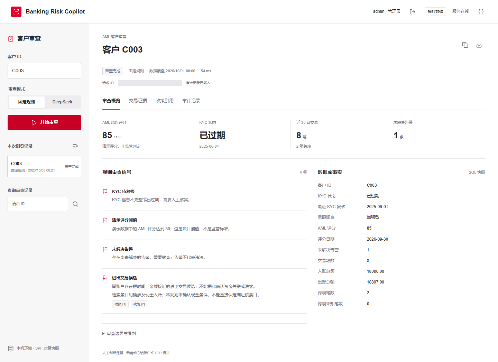
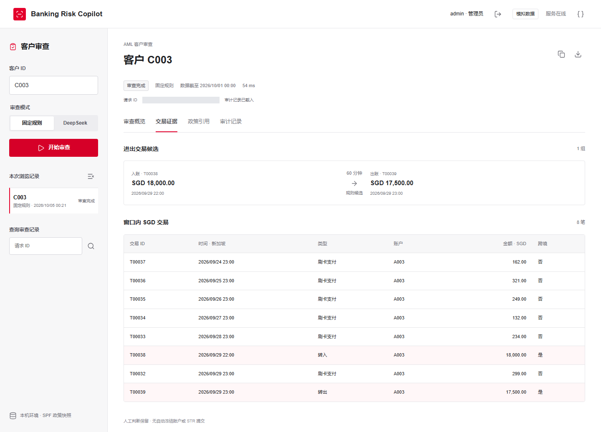
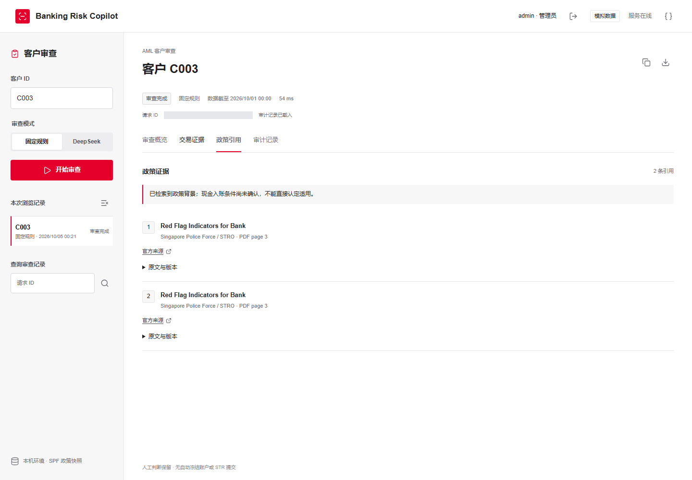
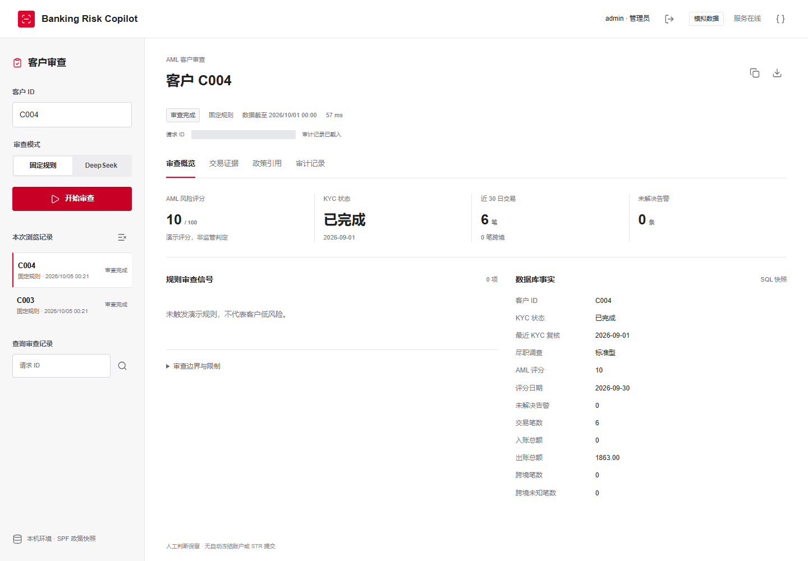
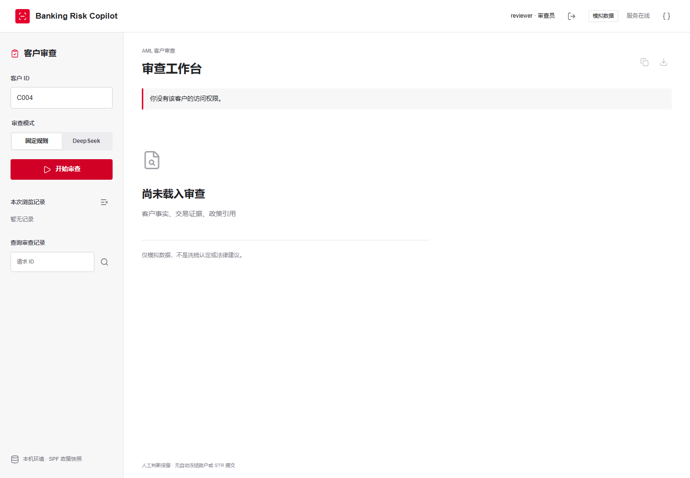

# Compliance-Aware Banking Risk Copilot

A local banking-risk portfolio MVP combining PostgreSQL analytics, policy RAG
and LangGraph orchestration for evidence-linked reviews by human analysts.
Uses synthetic data, not real customer or bank-internal information.

## What It Does

- Fixed SQL calculates customer facts and identifies demo transaction-pair candidates.
- LangChain retrieves cited policy context; LangGraph coordinates the review.
- Optional DeepSeek explanations undergo schema, reference and narrow prose checks.
- FastAPI and a browser workbench provide customer-scoped login and review access.
- Separate query/audit database roles preserve traceable success and failure records.

Stack: Python 3.12, PostgreSQL/pgvector, LangChain, LangGraph, FastAPI and Playwright.
Customer reviews use lexical retrieval; multilingual vector search is a separate
available workflow. See [architecture](docs/architecture.md).

## Workbench

Real local screenshots: synthetic data, deterministic mode, no provider calls.
Request IDs are masked and policy excerpts collapsed; these are not live AI outputs.



<details>
<summary>Transaction evidence, policy citations and access boundaries</summary>

Candidate transaction pair and SQL evidence:



Policy source locators and applicability caveat:



C004: no demo rule triggered, not low-risk certification:



C003-only reviewer denied access to C004:



</details>

## Run Locally

On Windows with Python 3.12 and Docker Desktop running, from the repository root:

```powershell
# First setup:
.\start.ps1 -InstallDependencies -Initialize
# Subsequent startup:
.\start.ps1
```

Open the printed URL (default http://127.0.0.1:8000/) and use the locally generated
account credentials. Policy ingestion may require internet access; snapshots and
embedding weights are not included in Git. Deterministic reviews need no API key.
DeepSeek mode requires a configured key and explicit paid consent.
See [deployment](docs/deployment.md) for accounts, caches and isolated reproduction.

## Verification and Limits

Observed verification: **116 unit tests and 11 free review scenarios passed**.
Bounded live tests drove fixes to numeric wording, evidence references and
missing-policy claims. Latest live results come from different revisions, not a
unified accuracy or stability benchmark. Historical failures remain documented.

```powershell
.\.venv\Scripts\python.exe -m unittest discover -s tests
.\.venv\Scripts\python.exe scripts/evaluate_review_suite.py
.\.venv\Scripts\python.exe scripts/check_release.py
```

These commands make no provider calls. The free suite needs an initialized
database and writes test audits; the release guard checks paths, not arbitrary
secret content. See [final evaluation](docs/final-evaluation.md) for evidence.

This is not a bank production system or legal advice. SQL is fixed-query, not
Text-to-SQL. The corpus has two SPF/STRO sources, not MAS/FATF coverage.
Reference membership does not prove semantic entailment; no demo rule triggered
does not certify low risk. Human review remains necessary. Local authentication
and single-attack tests do not establish enterprise security.

## Documentation

- [Schema](docs/schema.md) and [policy sources](docs/policy-corpus.md)
- [Customer review](docs/customer-review.md), [access control](docs/user-access.md) and [audit](docs/review-audit.md)
- [Database roles](docs/database-permissions.md) and [semantic retrieval](docs/semantic-retrieval.md)
- [Demo and resume description](docs/demo-handoff.md)
- [Production roadmap (proposal only)](docs/production-roadmap.md)
- [Development history and assessment links](docs/implementation-history.md)
