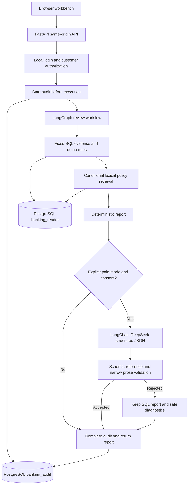

# Architecture and Trust Boundaries

## Local Review Path

The CLI uses the same audited review flow as local maintenance, without browser
login. Its paid mode is explicit; it is not the customer-authorized API boundary.
Separate semantic policy search uses local multilingual embeddings and pgvector.
The customer-review rule currently uses inspectable lexical retrieval, not that
semantic retriever. Do not describe every review as vector retrieval.

## Evidence and Storage

- Synthetic banking customers, accounts, transactions, scores and alerts live in
  PostgreSQL. Fixed SQL and candidate rules produce report snapshots.
- Public SPF/STRO source snapshots feed citation-preserving chunks. Two sources
  are ingested; MAS/FATF catalogue entries are not active corpus coverage.
- Local SQLite stores hashed credentials and opaque hashed sessions. Customer
  permissions apply to creating reviews and fetching existing records.
- The query role reads approved business/policy tables; the audit role writes
  bounded start/completion records. Owner access is explicit maintenance only.
- Audit records carry request identity, source/evidence snapshots, provenance and
  success/partial/failure status. Initial identity cannot be overwritten; this is
  not cryptographically signed or externally tamper-proof logging.
- Model output is untrusted. Pair references require both transactions. Schema,
  reference membership, explicit numeric labels and limited policy-presence
  patterns are checked. No complete natural-language entailment checker exists.

## Boundaries and Limitations

Provider failures retain SQL results when possible; audit-start failure prevents
model execution. No automatic paid retry is configured. Failed parse diagnostics
exclude raw content and exception prose, but accepted report snapshots may contain
synthetic customer information and must remain private by default.

The API is a localhost demo, not public hosting. Local password auth is not
enterprise SSO/MFA. Production monitoring, retention governance, legal review,
real-data authorization and large independent benchmarks are out of scope.
See [database permissions](database-permissions.md), [user access](user-access.md)
and [deployment](deployment.md) for implementation details.
